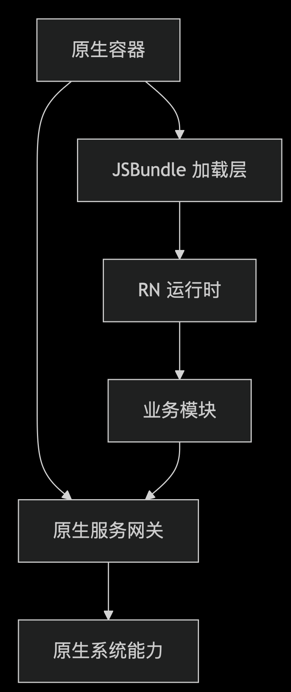
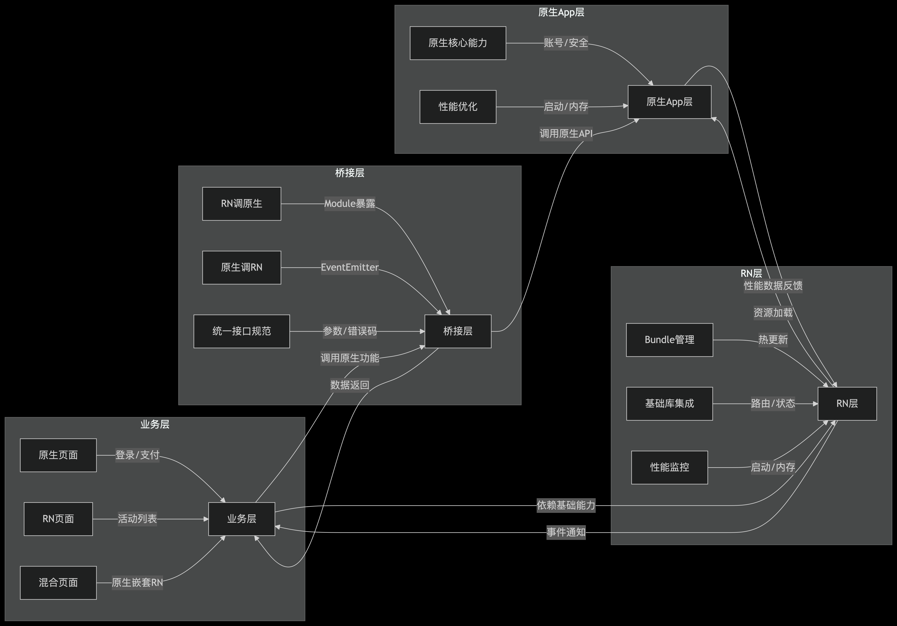

# React Native 集成原生应用完整方案（Bundle方式）

在此之前需要先了解一下为什么要将原生App的一些模块抽离出来使用RN集成：

 1. **体验一致性差：** 因系统特性差异，三端实现逻辑和 UI 效果难以统一，使用RN 可有效解决此类问题
 2. **更新迭代周期长：** 应用商店（如App Store、Google Play）审核的是原生部分的安装包（IPA/APK）。RN 热更新通过动态下载JS Bundle文件实现更新，无需重新提交安装包，因此不触发审核流程，可以实现快速维护升级。
 3. **开发成本高：** 同一需求需在 iOS、Android 及鸿蒙（如鸿蒙或其他平台）分别开发，存在重复劳动，且维护成本随业务复杂度线性增长。

::: tip 提示
注意：热更新仅能更新 JavaScript代码、资源文件（图片/字体等） 及部分原生模块配置（需提前预埋）。无法修改原生二进制代码
:::

JSBundle方式集成架构简图

## 一、整体架构设计
### 1. 架构概览
使用”原生APP+RN模块“方式，原生APP实现核心模块、支付等，RN模块实现通用的业务，方便热更新快速迭代。

### 核心开发工具
| 分类         | 工具名称              | 适用平台 | 功能描述                     | 稳定性评级 |
|--------------|-----------------------|----------|------------------------------|------------|
| 开发框架     | react-native@0.79.0          | 全平台   | 跨平台开发核心框架           | ⭐⭐⭐⭐⭐     |
| 鸿蒙支持     | react-native-harmony  | 鸿蒙     | RN鸿蒙适配器                 | ⭐⭐⭐       |
| 状态管理     | redux-toolkit mobx recoil         | 全平台   | 全局状态管理                 | ⭐⭐⭐⭐⭐     |
| 路由管理     | react-navigation   react-native-navigation   | 全平台   | 页面导航控制                 | ⭐⭐⭐⭐⭐     |
| 网络请求     | axios   react-native-axios   | 全平台   | HTTP请求与缓存               | ⭐⭐⭐⭐⭐     |
| 本地存储     | react-native-async-storage   async-storage   | 全平台   | HTTP请求与缓存               | ⭐⭐⭐⭐⭐     |

### 2. 架构说明
 1. **职责清晰：** 原生层聚焦稳定性和核心能力，RN 层聚焦业务灵活性，桥接层确保两者无缝通信。
 2. **渐进式集成：** 无需重构现有原生代码，通过新增 RN 模块逐步替换或补充业务，降低风险。
 3. **热更新支持：** RN 业务代码打包为 JS Bundle，通过服务器动态下发，原生代码仍走应用商店更新（核心能力变更时）

### 原生集成工具，核心依赖与第三方库

| 分类         | 工具名称                     | 适用平台      | 功能描述                     | 稳定性评级 |
|--------------|------------------------------|---------------|------------------------------|------------|
| 原生桥接     | react-native-bridge-builder react-native-bridge  | Android/iOS   | 桥接代码生成                 | ⭐⭐⭐⭐      |
| 鸿蒙桥接     | react-native-harmony-bridge  | 鸿蒙          | 鸿蒙桥接工具                 | ⭐⭐⭐       |
| 模块通信     | react-native-eventemitter    | 全平台        | 原生-RN事件通信              | ⭐⭐⭐⭐      |
| 启动优化     | react-native-splash-screen   | Android/iOS   | 启动屏控制                   | ⭐⭐⭐⭐      |
| 设备信息交互 | react-native-device-info | Android/iOS | 获取设备信息（型号、系统版本），用于适配或统计| ⭐⭐⭐⭐⭐ |
### 热更新与部署
| 分类         | 工具名称                | 适用平台      | 功能描述                     | 稳定性评级 |
|--------------|-------------------------|---------------|------------------------------|------------|
| 热更新       | Microsoft CodePush      | Android/iOS   | 云服务热更新                 | ⭐⭐⭐⭐⭐     |
| 热更新       | Pushy (国内推荐)        | Android/iOS   | 国内热更新方案               | ⭐⭐⭐⭐      |
| 鸿蒙更新     | 华为AppGallery Connect  | 鸿蒙          | 鸿蒙应用热更新               | ⭐⭐⭐⭐      |
| 版本控制     | react-native-version    | 全平台        | 版本管理自动化               | ⭐⭐⭐⭐      |

### UI组件与性能
| 分类         | 工具名称                | 适用平台 | 功能描述                     | 稳定性评级 |
|--------------|-------------------------|----------|------------------------------|------------|
| UI组件库     | Ant Design Mobile RN Taro UI      | 全平台   | Material Design组件          | ⭐⭐⭐⭐      |
| 性能监控     | React Native Performance| 全平台   | 性能指标监控                 | ⭐⭐⭐⭐      |
| 图片加载     | react-native-fast-image | 全平台   | 高性能图片加载               | ⭐⭐⭐⭐⭐     |
| 列表优化     | FlashList               | 全平台   | 高性能列表组件               | ⭐⭐⭐⭐⭐     |

::: tip 提示
注意：选择依赖和库以稳定性为首要考虑，尽量选择纯逻辑库，降低适配成本。
:::

## 二、原生APP与RN交互接口设计

### 1. 接口设计
 - **单一职责原则：** 使接口边界清晰，解耦业务逻辑与技术实现，实现”高内聚低耦合“
 - **标准化参数规范：** JSON 格式统一数据交换，错误码体系便于错误定位
 - **版本兼容性考虑：** 接口灰度发布能力，避免 "全有或全无" 的强更新，尽量做加法，保留多个版本，必要时可回滚到旧版本

 ### 2. 核心交互
  1. RN 调用原生能力（Method Call）通过原生 Module 暴露接口，RN 通过NativeModules调用
  2. 原生通知 RN 事件（Event Emit）通过DeviceEventEmitter发送事件，RN 监听接收
  
::: tip 提示
注意：敏感操作（支付/定位）由原生完全控制，RN 仅作为交互层，不接触核心业务逻辑。
:::
## 三、实施步骤与保障措施
 1. 分阶段实施
 - 阶段1：基础集成
    - 搭建 RN 开发环境（Node、watchman、cocoaPods、Xcode/Android Studio 配置），可运行到Android和IOS设备
    - 实现将一个简单页面集成到原生APP
    - 实现部分接口交互，如获取用户信息等
 - 阶段2：功能验证
    - 验证三端功能完整性，样式统一性。
    - 热部署更新服务，如Code Push或者自建服务器
::: warning 提示
React Native 开发人员大遗憾：微软宣布将于 2025 年 3 月 31 日关闭Visual Studio App Center。
:::
