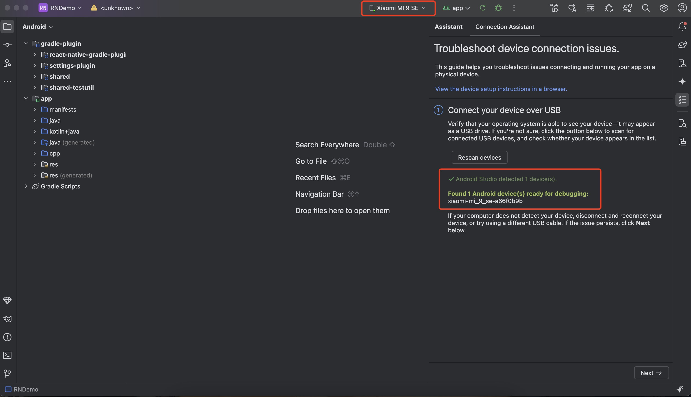
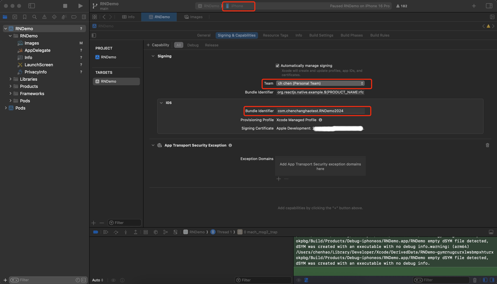
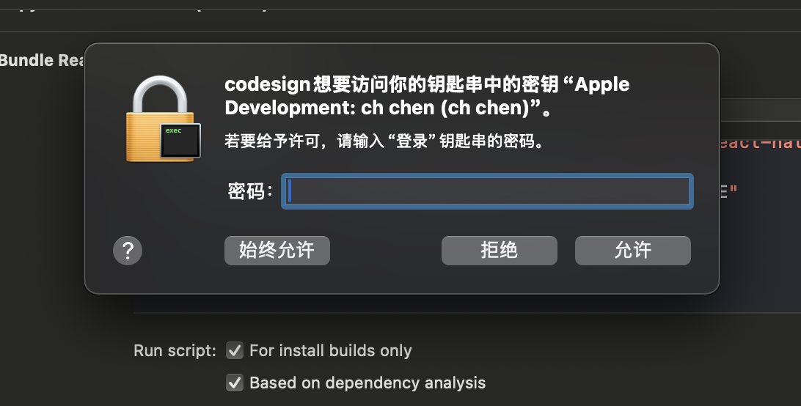
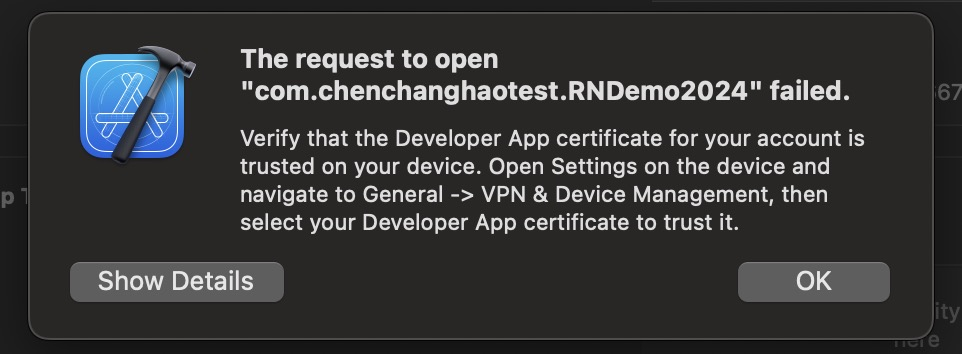
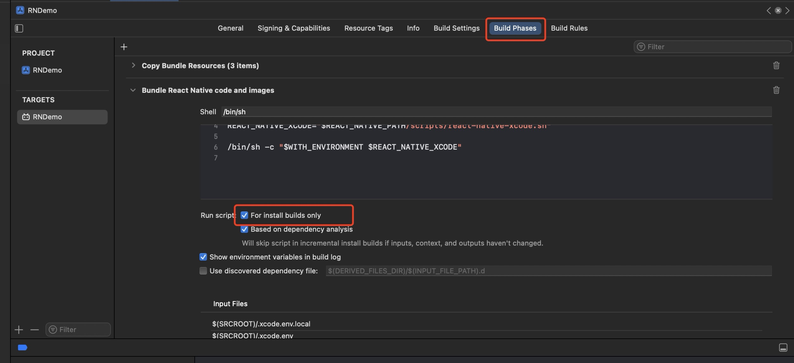

# 运行到真机调试

## 运行到Android手机
此次使用手机为小米9SE
#### 1. 首先配置好Android开发环境，保证项目先可以运行到Android模拟器
参照 [https://reactnative.cn/docs/environment-setup](https://reactnative.cn/docs/environment-setup)

#### 2. 手机进入可调式模式
将手机打开开发者模式，一般是进入系统设置找到系统版本号狂点几次，就会打开开发者模式，然后进入开发者选项，打开**USB调试**和**USB安装**，部分手机型号（比如小米）第一次打开**USB安装**需要插入SIM卡才行

#### 3. 连接手机到开发电脑
使用数据线将手机连接到开发电脑，注意手机要打开数据传输模式，电脑端使用`adb devices`查看是否识别到设备，正常会看到类似如下输出：
```sh
chenhao@chenhaodeMacBook-Pro RNDemo % adb devices
List of devices attached
a66f0b9b        device
```
`a66f0b9b`就是设备ID，在Android Studio可以看到识别到的设备



> 注意：运行到android手机时一定要关闭android模拟器，否则会报错


最后直接`yarn android`就可以将程序运行到安卓手机


## 运行到iPhone手机
此次使用手机为iPhone15

#### 1. 首先配置好IOS开发环境，保证项目先可以运行到IOS模拟器
参照 [https://reactnative.cn/docs/environment-setup](https://reactnative.cn/docs/environment-setup)

#### 2. 注册苹果开发者账号，[官方注册地址](https://developer.apple.com/account)，注册流程可参考[https://blog.csdn.net/weixin_43652106/article/details/132908063](https://blog.csdn.net/weixin_43652106/article/details/132908063)

#### 3. 注册好开发者账号后：
1. 进入XCode，选择项目，在右侧**Team**选项加入刚才注册的开发者账号，并且将IOS选项中的**Bundle Identifier**修改一下，与上方的**Bundle Identifier**不重复即可，否则会报错，将顶部选择为运行到iPhone，点击运行



2. 手机插上数据线连接到Mac，打开开发者模式
3. 运行时如果弹出索要密码框，需输入Mac密码来允许该操作，需多次同意


4. 运行时如果弹出此框


表示调试程序不被iPhone信任，需要进入iPhone设置依次进入“通用->VPN与设备管理->选择当前开发者APP->点击信任”，现在程序应该就可以运行到iPhone上了，摇晃iPhone点击**Open DevTools**可以在电脑端打开调试工具。

如果Xcode 编译项目时报 <font color="red">**Command PhaseScriptExecution failed with a nonzero exit code**</font>，可进入**Target -> Build Phases**，勾选**For install builds only** 来解决。
